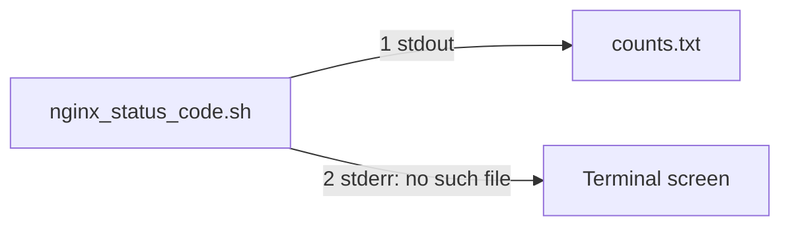

# Epic 1 topics

Study these in order. Task 1 (`scripts/nginx_status_count.sh`) uses topics 1 through 7, plus ShellCheck (topic 10). The others show up in later scripts.

## 1. Shebang (`#!/usr/bin/env bash`) and `chmod +x`

The script starts as a text file. Two things make that file runnable.

The first line is the shebang:

```bash
#!/usr/bin/env bash
```

- `#!` must be the first two characters. It tells the system that the rest of the line names the program which should read this file.
- `/usr/bin/env` searches the computer for a program by name.
- `bash` is that program. Bash reads every line under the shebang and runs it.

A reviewer runs `scripts/nginx_status_count.sh data/raw_logs/access.log`. The shebang is why that command uses bash, including on a Mac whose terminal is zsh.

`chmod` changes what people may do with a file. `+x` adds permission to start it as a program:

```bash
chmod +x scripts/nginx_status_count.sh
ls -l scripts/nginx_status_count.sh
```

The permission letters should contain `x`, for example `-rwxr-xr-x`. Until that `x` is there, the system answers `Permission denied` and never reads the shebang.

Task 1's first check is that this file exists and is executable. The shebang chooses bash. `chmod +x` allows the system to start the file.

### Permissions a developer should know

`ls -l` prints ten characters. The first is the file type: `-` is a normal file, `d` is a directory. The next nine are three groups of `rwx`: owner, group, everyone else. A missing permission shows as `-`.

`r` means read, `w` means write, `x` means execute. On a directory, `x` means you may enter it (`cd`) and open files inside by name. `r` on a directory means you may list the names.

Two ways to write the same change:

- Symbolic, naming who and what: `u` owner, `g` group, `o` others, `a` all. `+` adds, `-` removes, `=` sets exactly. `chmod u+x file` adds execute for the owner only. `chmod a+r file` lets everyone read it. `chmod go-w file` removes write from group and others.
- Numeric, three digits, owner then group then others. Add the values that should stay on: `r` is 4, `w` is 2, `x` is 1. `7` is `rwx` (4+2+1). `6` is `rw-`. `5` is `r-x`. `4` is `r--`. `0` is nothing.

Codes that come up constantly:


| Code  | Letters     | Use                                                                        |
| ----- | ----------- | -------------------------------------------------------------------------- |
| `644` | `rw-r--r--` | A normal file. Owner can edit it. Everyone can read it.                    |
| `755` | `rwxr-xr-x` | A script or a program other people may run. Also a normal directory.       |
| `700` | `rwx------` | A private script. Only the owner may read or run it.                       |
| `600` | `rw-------` | A private file, such as a key. Only the owner may read it.                 |
| `750` | `rwxr-x---` | Owner can do everything, the group can read and enter, others are blocked. |
| `640` | `rw-r-----` | Owner can edit, the group can read, others are blocked.                    |
| `777` | `rwxrwxrwx` | Everyone can read, change, and run it. Interview answer: do not use this.  |


`chmod 755 scripts/nginx_status_count.sh` is the numeric form of making task 1's script runnable. `chmod +x` only adds execute and leaves the other bits alone, which is the usual habit.

Three extra bits show up in interviews. They are a fourth digit in front of the three above.


| Bit    | Numeric | Symbolic         | Meaning                                                                                         |
| ------ | ------- | ---------------- | ----------------------------------------------------------------------------------------------- |
| setuid | `4755`  | `chmod u+s file` | The program runs as the file's owner.                                                           |
| setgid | `2755`  | `chmod g+s file` | The program runs as the file's group. On a directory, new files inherit that directory's group. |
| sticky | `1777`  | `chmod +t dir`   | Inside this directory, only a file's owner may delete it. `/tmp` is the usual example.          |


`umask` is the mask subtracted when a program creates a new file. A common umask is `022`, which turns a new file into `644` and a new directory into `755`. That is why a brand-new script needs `chmod +x` before it will run.

## 2. Strict mode: `set -euo pipefail`, and the SIGPIPE gotcha with `head`

Put this on the line after the shebang:

```bash
set -euo pipefail
```

Read it as three switches: `-e`, `-u`, and `-o pipefail`. They apply to lines inside the script, after bash has already started. A missing `bash`, or a script with no `x` permission, stops the computer before this line is ever read.

`-e` stops the script when a command inside it fails. Failure means the command finished with a number other than `0`.

```bash
set -e
ls data/raw_logs/missing.log
echo "this line does not run"
```

`ls` cannot find that file, so it fails, and the `echo` is skipped. The long name of this switch is `set -o errexit`.

`-u` is about names, not commands. A variable is a named box that holds a value, such as the log path. `-u` stops the script when a line uses a box that was never filled. The long name is `set -o nounset`.

```bash
set -u
echo "$logpath"
```

`logpath` was never set, so bash stops and says the variable is unbound. In task 1 this is the guard against a typo in the path's name.

`-o` means "turn on a named option." `pipefail` is the option. A pipe is the `|` character. It connects two commands: the left command's output becomes the right command's input.

```bash
grep 500 data/raw_logs/access.log | head -n 5
```

`grep` finds the lines. `head` receives them. By default the shell reports only how `head` finished, and ignores a failure inside `grep`. `set -o pipefail` makes the chain fail when any command in the chain fails. Task 1's count is this kind of chain, and the chain reads the whole log.

Other switches worth knowing:


| Switch   | Long name          | What it does                                                         |
| -------- | ------------------ | -------------------------------------------------------------------- |
| `set -x` | `set -o xtrace`    | Prints each command before running it. Used while debugging.         |
| `set -C` | `set -o noclobber` | Refuses to overwrite an existing file with `>`.                      |
| `set -f` | `set -o noglob`    | Stops `*` from expanding into filenames.                             |
| `set +e` |                    | Turns `-e` back off. `+` is the off switch for any of these letters. |


`head` prints the start of its input and then exits. `head -n 5` prints five lines. When it exits, it closes the pipe. `grep`, on the left, may still be writing. Writing into a closed pipe raises signal 13, called `SIGPIPE`. A command killed by a signal exits with `128` plus the signal number, so `grep` exits `141`.

With `-e` and `pipefail` both on, that `141` counts as failure and the script stops. `head` itself succeeded. This appears when you ask for only the first few matching lines. Task 1 counts every status code, so its chain does not use `head`.

```bash
set -euo pipefail
grep 500 data/raw_logs/access.log | head -n 5
echo "reached this line"
```


## 3. Positional args (`$1`, `$2`, `$#`), default values `${1:-}`, usage/help function

The words typed after the script name are positional arguments. The number in the name is the position on the command line.

```bash
scripts/nginx_status_count.sh data/raw_logs/access.log
```


| Name | What it holds for that command                             |
| ---- | ---------------------------------------------------------- |
| `$0` | The script path, `scripts/nginx_status_count.sh`           |
| `$1` | The first word after it, `data/raw_logs/access.log`        |
| `$2` | The second word. Task 1 has none, so this is empty.        |
| `$#` | How many words came after the script name. Here it is `1`. |


`$0` is not counted in `$#`. Task 1 needs exactly one word, the log path. Task 3 will use `$2` for the threshold number. You read an argument with quotes: `"$1"`.

Running the script with no path does not fail by itself. `set -e` only reacts when a command returns a failure. Nobody has run a failing command yet, so `-e` stays quiet. `set -u` is the switch that fires if a later line reads a bare `$1`, because `$1` was never filled in. That is an unset parameter, which is the kind of missing name `-u` watches.

`${1:-fallback}` means "use `$1` when it has a value, otherwise use the text `fallback`." The substitute is text, such as a path. It is not a function. `${1:-data/raw_logs/access.log}` would silently use that file when the person typed nothing. `${1:-}` has nothing after the dash, so the substitute is an empty string. That empty form lets you look at the first argument while `set -u` is on.

`usage` is not built into bash. It is a name you make up for a block you write. The block prints one line of help. You call it yourself when `"$#"` is not `1`. Task 1 should do that instead of filling in a default path, because the reviewer passes the path on purpose. `$0` inside the message repeats the path the person actually typed:

```bash
usage() {
    echo "usage: $0 LOG_FILE"
}
```

Call `usage` when `"$#"` is not `1`. The missing-file check comes in the next topic. This topic only checks that a path was typed.

## 4. Input validation: `[[ -f "$file" ]]`, `[[ -r ]]`, integer check

`[[ ]]` is bash's yes-or-no test. You put a question inside it. The answer yes has status `0`. The answer no has status `1`.

The path you test is the word the person typed, saved into a variable after the usage check:

```bash
logpath="$1"
```

`"$1"` is that word. A path written directly in the script, such as `../data/raw_logs/nginx.log`, ignores whatever the reviewer typed. The practice log is `data/raw_logs/access.log`, and the command passes that path in from the place where the command is run.

`-f` asks "is this a regular file?" A missing path answers no. A directory answers no. `-r` asks "am I allowed to read it?" A file with no read permission answers no.

```bash
[[ -f "$logpath" ]]
[[ -r "$logpath" ]]
```

The quotes around `"$logpath"` keep a path with spaces as one path. `!` turns the answer around, so `[[ ! -f "$logpath" ]]` asks "is this not a regular file?"

Put the test in an `if`. `set -e` does not stop the script when a test inside `if` answers no. The `then` branch is where you react.

```bash
if [[ ! -f "$logpath" ]]; then
    echo "no such file: $logpath"
fi
```

The `;` ends the test command. `then` is the next command, and bash wants the test finished before `then` begins. A newline does that same job, so this form needs no semicolon:

```bash
if [[ ! -f "$logpath" ]]
then
    echo "no such file: $logpath"
fi
```

Use `;` when two commands share a line, as in `mkdir logs; cd logs`. It does not stop the script. `exit` stops the script. `fi` closes the `if`.

Task 1 needs `-f` and `-r`. Both should pass before any counting starts. Other questions use the same brackets:


| Test | Question                                     |
| ---- | -------------------------------------------- |
| `-e` | Does this path exist, of any kind?           |
| `-f` | Is it a regular file?                        |
| `-d` | Is it a directory?                           |
| `-r` | Can I read it?                               |
| `-w` | Can I write it?                              |
| `-x` | Can I execute it?                            |
| `-s` | Does it exist and contain at least one byte? |


The integer test is for task 3, where `$2` is the threshold. `=~` means "matches this pattern."

```bash
[[ "$n" =~ ^[0-9]+$ ]]
```

`^` is the start of the text, `$` is the end, and `[0-9]+` is one or more digits. `100` matches. `100abc`, an empty string, and `-1` do not. Leave the pattern outside quotes. Quoted, bash searches for those characters literally.

## 6. stdout vs stderr: streams, `>&2`, `2>&1`, `/dev/null`

A stream is a one-way hose for text. The script does not paint the terminal itself. It pushes text into a hose, and the terminal is where that hose is plugged in. `scripts/nginx_status_code.sh` starts with three hoses already attached.


| Number | Name   | What it carries                                                              |
| ------ | ------ | ---------------------------------------------------------------------------- |
| `0`    | stdin  | Text coming in. Task 1 rarely uses it, because the log path arrives as `$1`. |
| `1`    | stdout | The normal result. Task 1's status counts belong here.                       |
| `2`    | stderr | Errors and warnings. The usage line and the bad-path lines belong here.      |


A plain `echo` writes to hose `1`. `>&1` says "send this output to hose `1`," so it looks the same as `echo` with nothing after it. `>&2` moves that output to hose `2`:

```bash
echo "Usage: $0 LOG_FILE" >&2
```

The `&` means the number is a stream, not a filename. `>2` with no `&` would create a file named `2` and write the message into it. The long spelling of `>&2` is `1>&2`: take hose `1` and connect it to hose `2`.

Both hoses are plugged into the same screen, so the words look the same until you unplug one. This sends hose `1` into a file and leaves hose `2` on the screen:

```bash
scripts/nginx_status_code.sh data/raw_logs/missing.log > counts.txt
```




`>` with no number means `1>`. `counts.txt` stays empty, because a missing file produces no counts. The words `no such file` still appear in the terminal. `2> errors.txt` does the opposite: the error goes into the file and the screen stays quiet.

`2>&1` connects hose `2` to wherever hose `1` is currently going. After `> counts.txt 2>&1`, the result and the errors both land in `counts.txt`.

`/dev/null` is a hose end that throws text away.

```bash
echo "noise" >/dev/null
echo "noise" 2>/dev/null
```

The first throws away normal output. The second throws away errors.

## 5. Exit codes (`exit 0` / `1` / `2`) and `$?`

Every command ends with a number called the exit code. `0` means the command worked. Any other number means it failed. This is the shell's scale. The command named `true` exits `0`. The command named `false` exits `1`.

```bash
true; echo $?
false; echo $?
```

`$?` is the exit code of the command that just finished. An `if` takes its yes branch when that number is `0`.

`2` is not a third yes-or-no value. It is a second kind of failure. The usual split in a shell script is:


| Code | Meaning in your script                                                                                                                                 |
| ---- | ------------------------------------------------------------------------------------------------------------------------------------------------------ |
| `0`  | The count ran and was printed. Reaching the end of the script without `exit` uses the last command's code, which is `0` when that command worked.      |
| `1`  | The command was typed well enough, and the work failed. A missing log, a directory, or a file you cannot read. Task 1 requires `1` for a missing file. |
| `2`  | The command itself was typed wrong. No path, or an extra word. Bash uses `2` when one of its own builtins is misused.                                  |


The missing-file lines in `scripts/nginx_status_code.sh` use `exit 1`. The `usage` function uses `exit 2`. A missing argument is a typing mistake. A missing file is a failed read. The ticket demands `1` for the missing file.

A few other numbers show up later. `127` means the command was not found. `128` plus a signal number means the command was killed. `SIGPIPE` is signal `13`, so that death is exit `141`.

## 7. Quoting (`"$var"`)

`"$logpath"` keeps the path as one word. A path with a space is still one path. Leave the quotes off and the shell splits the path on spaces, and a `*` in a path turns into a list of filenames.

Inside `awk`, use single quotes. Single quotes give `$1` and `$9` to `awk`. Double quotes let bash replace them first, and `awk` then sees an empty piece.

```bash
awk '{ print $9 }' "$logpath"
```

## 8. `head`, `awk`, and the status-code count

### `head`

`head` prints the start of a file, then stops. `-n 5` means five lines. `head -5` is the same request. `head` can open the file itself:

```bash
head -n 5 "$logpath"
```

`cat "$logpath" | head -n 5` also prints five lines, and inside this script it exits `141`. `head` closes the pipe after five lines, `cat` is still writing, and `set -o pipefail` keeps the `SIGPIPE` death. `>&2` only moves the text to the error hose. It does not change `141`.

`tail -n 5` prints the last five lines. `wc -l` prints how many lines there are.

### What `awk` is

`awk` is a program. The name is the initials of Aho, Weinberger, and Kernighan. It reads text one line at a time, splits the line on spaces, and runs the instructions in the braces.

| Name | Meaning |
|---|---|
| `$0` | The whole line |
| `$1` | The first piece |
| `$9` | The ninth piece |
| `NF` | How many pieces this line has |
| `$i` | The piece whose number is stored in `i` |

`${i}` is shell spelling. `awk` rejects it. A `for` loop has to sit inside the braces. Without them, `awk` stops at the word `for` and bails out.

`print` writes its values and ends the line. `echo` does not exist inside `awk`. `printf` writes an exact shape and does not end the line. `"%d=%s "` uses `%d` for the piece number and `%s` for the piece text. While learning, `print` is enough:

```bash
head -n 1 "$logpath" | awk '{ for (i = 1; i <= NF; i++) print i "=" $i }'
```

`i <= NF` includes the last piece. `i < NF` drops it.

### Why piece 9 is the status

The Nginx `timed` format used by this project is:

```text
IP - user [time zone] "METHOD path HTTP/1.1" STATUS SIZE "referer" "browser" rt=...
```

Counted on spaces, `STATUS` is piece 9. Spaces inside the browser name come after the status, so they do not move it. A path with a raw space would. Nginx writes that space as `%20`, and `data/raw_logs/access.log` does too.

`awk '{ print $9 }'` prints that piece for every line. On this log the pieces are `200`, `404`, `500`, and the rest. On a random file, piece 9 is some other word. The script still exits `0` and counts that word. `awk` does not fail just because the word is not a status code.

### The pipeline

```bash
awk '$9 ~ /^[1-5][0-9][0-9]$/ { print $9 }' "$logpath" |
    sort |
    uniq -c |
    sort -rn |
    awk '{ print $2, $1 }'
```

`sort` puts identical codes next to each other. `uniq` only collapses neighbors, so the `sort` in front of it is required.

`uniq -c` counts the current block and writes the count first:

```text
      3 200
      1 404
```

The spaces before the count are `uniq`'s padding. The count is piece 1 and the code is piece 2.

`sort -rn` orders those rows by the number, largest first. `-n` compares numbers. `-r` reverses the order.

The last `awk` swaps the pieces so the code comes first, which is the ticket's shape: `200 684`.

### The status pattern

`$9 ~ /^[1-5][0-9][0-9]$/` asks whether piece 9 matches the pattern between the slashes.

| Piece | Meaning |
|---|---|
| `~` | Matches. `!~` means the opposite. |
| `/.../` | The fences around the pattern |
| `^` | Start of piece 9 |
| `[1-5]` | One digit from 1 to 5 |
| `[0-9]` | One digit from 0 to 9 |
| `$` | End of piece 9. Inside the slashes this `$` means end, not a field. |

The shape is a three-digit number from `100` through `599`. `200` matches. `980` does not. An empty piece does not. `499` matches, and this log uses it: Nginx writes `499` when the client closes the connection.

The blank line and the cut-off line at the bottom of `access.log` have no piece 9. Without the pattern, `uniq -c` counts those two lines as `2` with no code, and the swap prints a lone `2`. The pattern drops them. `504 2` above that lone `2` is a real row: status `504` happened twice.

A list of codes is a second check on the piece you already picked. It does not choose which piece is the status. The status is the number after the quoted request. A `200` inside a path or a size stays out of the tally.

For `data/raw_logs/access.log` the finished list starts `200 684`, then `404 89`, then `304 75`.

## Still to study

9. `trap` for cleanup on `EXIT`/`ERR`
10. Functions, `local` variables, `readonly`
11. ShellCheck and fixing its warnings
12. `LC_ALL=C` for fast, predictable `sort`
13. Handling `.gz` rotated logs with `zcat -f`
14. Testing shell scripts with bats-core
